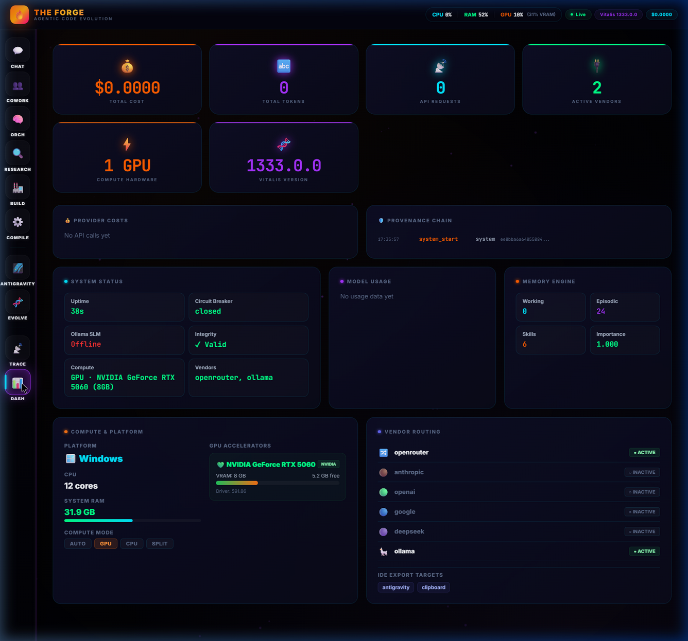
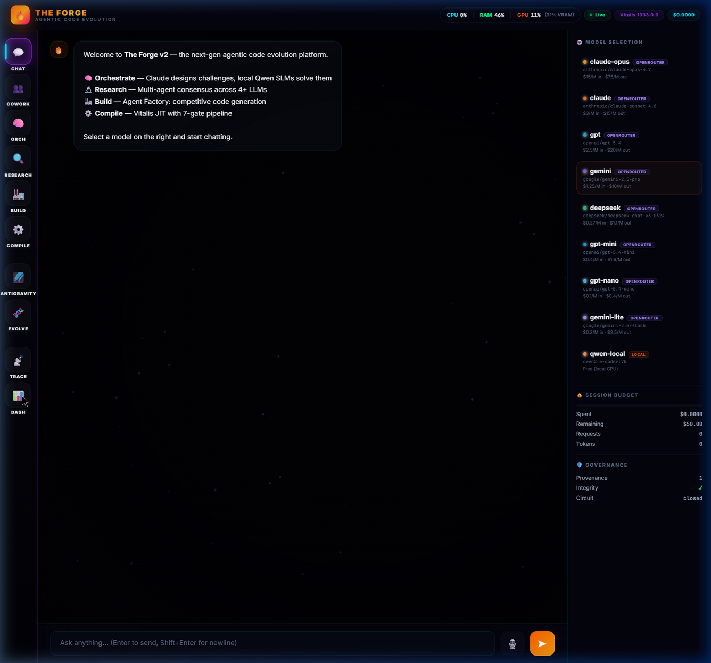

<div align="center">

# 🔥 The Forge

### Multi-Agent Code Evolution Platform

[](https://python.org)
[](https://github.com/ModernOps888/vitalis)
[](LICENSE)
[](https://openrouter.ai)
[](#-compute--hardware)

**Multiple LLMs compete to solve coding challenges.<br>
The Vitalis compiler is the impartial judge.<br>
Evolution breeds the winners into code no single model could write.**

<br>

> **`Claude's elegance × GPT's brute force × Gemini's lateral thinking → native compiled code`**

<br>



</div>

---

## 💡 The Idea

Every AI coding agent generates code. **None of them evolve it.**

The Forge takes solutions from multiple LLMs, compiles them through a real JIT compiler (Vitalis), benchmarks them with statistical rigor, and then **breeds the winners together** — crossover, mutation, selection — for hundreds of generations.

The result: code that's measurably better than any single model wrote.

```
4 LLMs × 1 challenge × 100 generations = code no single model could write
```

---

## 🏗 Architecture

```
┌─────────────────────────────────────────────────────────────┐
│                  8. NATIVE DESKTOP BRIDGE                    │
│  File Explorer · VS Code · PowerShell · Clipboard Sync      │
├─────────────────────────────────────────────────────────────┤
│                  7. GOVERNANCE LAYER                         │
│  SHA-256 provenance · Policy engine · Circuit breaker        │
├─────────────────────────────────────────────────────────────┤
│                  6. MEMORY & SKILLS                          │
│  Working → Episodic → Semantic · Cosine retrieval · Decay    │
├─────────────────────────────────────────────────────────────┤
│                  5. SELF-IMPROVEMENT ENGINE                  │
│  LLM patching · AST validation · Fitness gating · Backup    │
├─────────────────────────────────────────────────────────────┤
│                  4. AGENT FACTORY                            │
│  16 artifact types · 8 languages · Auto-deploy               │
├─────────────────────────────────────────────────────────────┤
│                  3. EVOLUTION LAYER                          │
│  Boltzmann · Quantum annealing · Bayesian UCB · Lévy flight  │
├─────────────────────────────────────────────────────────────┤
│                  2. COMPILER LAYER (Vitalis)                 │
│  Lex → Parse → Type-check → Lint → Capability → JIT → Exec  │
├─────────────────────────────────────────────────────────────┤
│                  1. ORCHESTRATION LAYER                      │
│  Multi-LLM dispatch · Budget tracking · Cost observability   │
└─────────────────────────────────────────────────────────────┘
```

---

## 🚀 Quick Start

### Prerequisites

| Tool | Version | Purpose |
|------|---------|---------|
| **Python** | 3.12+ | Orchestration engine |
| **API Key** | Any vendor | At least one: OpenRouter, Anthropic, OpenAI, Google, or DeepSeek |
| **Ollama** *(optional)* | Latest | Local GPU/CPU inference (qwen, llama, etc.) |
| **Vitalis** *(optional)* | v60 | JIT compilation backend (falls back to Python) |

### Install & Run

```bash
# Clone The Forge
git clone https://github.com/ModernOps888/the-forge.git
cd the-forge

# Install dependencies (minimal — mostly stdlib)
pip install -r requirements.txt

# Set at least one API key (see .env.example for all options)
# Windows PowerShell:
$env:OPENROUTER_API_KEY = "sk-or-v1-your-key-here"
# Or use direct vendor keys for lower latency:
$env:ANTHROPIC_API_KEY = "sk-ant-..."
$env:OPENAI_API_KEY = "sk-..."

# Linux/macOS:
export OPENROUTER_API_KEY="sk-or-v1-your-key-here"

# Launch the server + dashboard
python forge_server.py

# Open dashboard
# → http://localhost:8777
```

### CLI Usage

```bash
# Run a demo tournament (mock providers, no API keys needed)
python forge_cli.py demo --generations 5 --population 10

# Compile a .sl snippet through Vitalis
python forge_cli.py compile "fn main() -> i64 { 42 }"

# Type-check without executing
python forge_cli.py check "fn main() -> i64 { 42 }"

# Run a full tournament from a challenge file
python forge_cli.py challenge challenges/sort_integers.json --generations 20

# Chat with any model
python forge_cli.py chat "Explain quicksort in Vitalis .sl" --model claude

# Multi-agent research (all models answer, then synthesize)
python forge_cli.py consensus "Best practices for Rust error handling"

# Build an artifact (4 models compete)
python forge_cli.py build "Build a GitHub webhook receiver with HMAC verification"

# Orchestrate a complex task
python forge_cli.py orchestrate "Design a microservice architecture for a payment gateway"
```

---

## 🏭 Agent Factory

The Factory is the crown jewel. Tell it what to build, and 4 models compete to write the best implementation.

```python
from forge import factory_build

result = factory_build(
    description="Build a GitHub MCP server with PR review and issue triage tools",
    artifact_type="mcp_server",  # or "auto" to detect
)

print(result.leaderboard())
# Winner is auto-saved with all deployment config
```

### Supported Artifact Types

| Type | Language | What It Generates |
|------|----------|-------------------|
| `agent` | Python | Autonomous agent with tools, memory, multi-step reasoning |
| `mcp_server` | Python | MCP server with JSON-RPC, tool schemas, stdio transport |
| `api` | Python | FastAPI REST API with Pydantic models, CORS, OpenAPI docs |
| `cli` | Python | CLI tool with argparse, rich output, config management |
| `pipeline` | Python | Data pipeline with transform stages, validation, sinks |
| `integration` | Python | Third-party connector (Slack, GitHub, Notion) |
| `sdk` | Python | Client library with retries, auth, pagination |
| `webhook` | Python | Webhook receiver with HMAC verification, retry queue |
| `rust_lib` | Rust | Library crate with error types, tests, Cargo.toml |
| `go_service` | Go | Microservice with handlers, middleware, graceful shutdown |
| `react_app` | TypeScript | React/Next.js component with hooks, CSS, accessibility |
| `terraform` | HCL | IaC module with variables, outputs, remote state |
| `workflow` | YAML | GitHub Actions CI/CD workflow |
| `extension` | TypeScript | VS Code extension with package.json, tsconfig |
| `docker` | Dockerfile | Dockerfile + docker-compose.yml |
| `skill` | Vitalis .sl | Native JIT-compiled hot-path function |

### Scoring Pipeline

```
LLM Generation (4 models)
        ↓
Vitalis Heuristic Scoring (sub-µs, native Rust)
  • Line count, import density, error handling, complexity
        ↓
LLM Semantic Scoring (Gemini, cheapest model)
  • Correctness, completeness, security, quality, production-readiness
        ↓
Final Score = 40% LLM + 60% Heuristic
  (We trust math over LLM self-evaluation)
        ↓
Winner saved + auto-deployed with config files
```

### Auto-Deployment

Every artifact type gets full deployment wiring:

| Type | Generated Files |
|------|----------------|
| `mcp_server` | `server.py`, `mcp.json` (Cursor), `vscode-mcp-snippet.json`, `README.md` |
| `api` | `main.py`, `requirements.txt`, `Dockerfile`, `docker-compose.yml`, `.env.example` |
| `cli` | `tool.py`, `pyproject.toml`, `run.sh` |
| `agent` | `agent.py`, `requirements.txt`, `run.sh`, `agent.service` (systemd) |
| `rust_lib` | `src/lib.rs`, `Cargo.toml` |
| `go_service` | `main.go`, `go.mod`, `Makefile`, `Dockerfile` |
| `react_app` | `Component.tsx`, `package.json` |
| `terraform` | `main.tf`, `backend.tf`, `terraform.tfvars.example` |

---

## 🧬 Evolution Engine

Not a basic genetic algorithm. This is research-grade evolutionary computation powered by native Rust hotpaths.

### Selection Algorithms

| Algorithm | Purpose |
|-----------|---------|
| **Boltzmann (Softmax) Selection** | Temperature-controlled exploration/exploitation. T→0 = greedy, T→∞ = random |
| **Bayesian UCB1** | Multi-armed bandit — try under-explored solutions more |
| **Elite Passthrough** | Top N individuals survive unchanged |
| **Quantum-Inspired Annealing** | Probabilistically accept worse solutions to escape local optima |

### Crossover Operators

| Operator | What It Does |
|----------|-------------|
| **Uniform Crossover** | For each line, randomly pick from parent A or B |
| **Single-Point Crossover** | Swap tails at a random body line |
| **AST-Aware Crossover** | Swap entire brace-depth blocks between parents (prevents syntax breaks) |

### Mutation Operators

| Operator | What It Does |
|----------|-------------|
| **Swap Lines** | Swap two adjacent body lines |
| **Insert Guard** | Add an early-return guard clause |
| **Change Constant** | Alter a numeric literal by a Lévy-flight step |
| **Add Comment** | Inject a descriptive comment (drives novelty score) |
| **Rename Variable** | Rename a variable for code distance |

### The 6 Fitness Dimensions

| Dimension | Weight | Source |
|---|---|---|
| **Correctness** | 30% | Test case pass rate |
| **Performance** | 25% | Relative execution speed, algorithmic complexity |
| **Code Quality** | 15% | Structure, naming, documentation, type hints |
| **Robustness** | 15% | Error handling, input validation, edge cases |
| **Efficiency** | 10% | Memory patterns, allocations, streaming |
| **Novelty** | 5% | Code distance from population (prevents convergence) |

---

## 🔒 The 7 Compiler Gates

Every submission passes through 7 gates before being scored:

```
Source → LEX → PARSE → TYPE CHECK → LINT → CAPABILITY → COMPILE → EXECUTE
          ↓      ↓         ↓          ↓        ↓          ↓         ↓
        Reject  Reject   Reject    Score    Reject     Reject    Score
```

If any gate fails, the submission is eliminated. The compiler is the impartial judge — it doesn't care which LLM wrote the code.

---

## 🧠 Three-Tier Memory

```
┌──────────────────────────────────────────┐
│  Tier 1: WORKING MEMORY (in-RAM)         │
│  Per-session, cosine dedup via Vitalis    │
│  Max 30 entries, importance-weighted      │
├──────────────────────────────────────────┤
│  Tier 2: EPISODIC MEMORY (JSON on disk)  │
│  EMA importance decay, 500 entry limit    │
│  Automatic eviction of low-importance     │
├──────────────────────────────────────────┤
│  Tier 3: SEMANTIC (Skills + Instructions)│
│  Injected into system prompts            │
│  Boltzmann-selected based on query match │
└──────────────────────────────────────────┘
```

**Skills** are context-aware prompt injections. When you ask about debugging, the debugging skill activates and enriches the system prompt. Skills have fitness scores that update via adaptive fitness scoring.

**Instructions** are standing orders (e.g., "Be concise", "Use type hints") that persist across sessions.

---

## 🛡️ Self-Improvement Engine

The Forge can modify its own source code:

```
User instruction → LLM generates line-range patches
                          ↓
                    JSON repair layer
                          ↓
                    AST syntax validation (Python)
                          ↓
              ┌─── Fitness Gate ───┐
              │  Baseline score    │
              │  Mutant score      │
              │  Regression? BLOCK │
              │  Below floor? BLOCK│
              └────────────────────┘
                          ↓
                    Auto-backup (.bak)
                          ↓
                    Overwrite + hot-swap
```

**Safety layers:**
1. JSON repair (fix truncated LLM output)
2. AST dry-run before overwrite
3. 6-dimensional fitness scoring — **no regressions allowed**
4. Quality floor (30/100 minimum)
5. Auto-backup before every write
6. Hot-swap only when patching the server itself

---

## 🔗 Governance & Provenance

### SHA-256 Provenance Chain

Every action is recorded in a tamper-evident, hash-chained ledger:

```python
entry = ProvenanceEntry(
    timestamp=time.time(),
    event_type="factory_complete",       # submission, compilation, mutation, promotion...
    entity_id="run_a1b2c3d4",
    actor="factory",
    data={"winner_provider": "claude", "score": 87.2},
    parent_hash="previous_entry_sha256",
    entry_hash="sha256(timestamp|type|id|actor|data|parent)",
)
```

Modify any entry → all subsequent hashes invalidate → tamper detected.

### Policy Engine

| Policy | Enforcement |
|--------|-------------|
| No file system access | Compile-time capability check |
| No network access | Compile-time capability check |
| No process execution | Compile-time capability check |
| Budget enforcement | Halt all calls when budget exhausted |
| Type safety | Type-check must pass before JIT |
| Timeout enforcement | Kill execution exceeding limit |
| Regression prevention | Champion must beat current best |
| Novelty threshold | Reject <10% code distance |

### Circuit Breaker

Protects against cascading API failures:
- **Closed** → normal operation
- **Open** → blocks all calls after N consecutive failures
- **Half-open** → allows one test call after cooldown

---

## 💰 Budget & Cost Tracking

Every API call is traced with:

| Metric | Tracked |
|--------|---------|
| Input/output tokens | Per request |
| Cost (USD) | Per request, per provider |
| Latency | Per request (ms) |
| EMA spike detection | Alert on anomalous costs |
| Per-provider breakdown | Who's expensive, who's cheap |
| Budget enforcement | Hard cap with remaining balance |
| Optimization hints | "Switch to Gemini for 3x savings" |

```python
tracker = get_tracker(BudgetConfig(max_budget_usd=50.0))
# Every call auto-records. Dashboard shows real-time spend.
```

---

## 🖥️ Live Dashboard

The Forge ships with a full interactive dashboard at `http://localhost:8777`:



| Tab | Features |
|-----|----------|
| **Chat** | Multi-model chat with vendor badges (DIRECT/OPENROUTER/LOCAL) |
| **Cowork** | Desktop co-work agent with native OS hooks |
| **Research** | Fan query to multiple models, consensus synthesis |
| **Build** | Agent Factory — 4 models compete, leaderboard scoring |
| **Compile** | Vitalis .sl code compilation & execution |
| **Dashboard** | KPIs, Compute & Platform panel, Vendor Routing matrix |
| **Orchestrate** | Multi-step complex task execution |
| **Evolve** | Self-improvement engine with fitness gating |
| **Trace** | Execution traces + Human-in-the-Loop approvals |
| **Antigravity** | IDE export inbox |

### Dashboard Highlights

- **6 KPI Cards**: Total Cost, Tokens, Requests, Active Vendors, GPU Count, Vitalis Version
- **Compute & Platform Panel**: Detected GPU (name, VRAM bar), OS badge, CPU cores, RAM, compute mode selector
- **Vendor Routing Matrix**: Shows which vendors are ACTIVE/INACTIVE with IDE export targets
- **Real-time telemetry**: CPU%, RAM%, GPU% with VRAM utilization in the top bar

---

## 🐍 Python SDK

```python
from forge import Arena, ArenaConfig, Challenge

# Define a challenge
challenge = Challenge(
    name="Fibonacci",
    description="Compute the nth Fibonacci number",
    function_signature="fn fib(n: i64) -> i64",
)

# Create arena
arena = Arena(config=ArenaConfig(max_generations=50))
arena.register_provider("claude", my_claude_api)
arena.register_provider("gpt", my_gpt_api)

# Run tournament
tournament = arena.run(challenge)

# Get the champion
print(f"Winner: {tournament.champion.fitness.total}")
print(tournament.champion.source_code)
```

### Multi-Agent Research

```python
from forge import multi_agent_research, consensus

# Ask all models the same question
results = multi_agent_research("Best Rust error handling patterns")
# → {"claude": "...", "gpt": "...", "gemini": "...", "deepseek": "..."}

# Or get a synthesized consensus
result = consensus("Compare actor model vs CSP for Go concurrency")
# → {"individual": {...}, "consensus": "merged answer", "cost_usd": 0.003}
```

### Smart Router

```python
from forge import auto_route

# Automatically picks cheapest model that can handle the task
answer = auto_route("What's 2+2?")           # → Gemini (cheapest)
answer = auto_route("Design a payment API")   # → Claude (premium)
```

---

## 🔧 Model Registry & Multi-Vendor Routing

| Name | Model ID | Tier | Routing |
|------|----------|------|--------|
| `claude` | `anthropic/claude-sonnet-4.6` | Premium | Direct → OpenRouter fallback |
| `claude-opus` | `anthropic/claude-opus-4.7` | Elite | Direct → OpenRouter fallback |
| `gpt` | `openai/gpt-5.4` | Premium | Direct → OpenRouter fallback |
| `gpt-mini` | `openai/gpt-5.4-mini` | Mid | Direct → OpenRouter fallback |
| `gpt-nano` | `openai/gpt-5.4-nano` | Economy | Direct → OpenRouter fallback |
| `gemini` | `google/gemini-2.5-pro` | Premium | Direct → OpenRouter fallback |
| `gemini-lite` | `google/gemini-2.5-flash` | Economy | Direct → OpenRouter fallback |
| `deepseek` | `deepseek/deepseek-chat-v3-0324` | Economy | Direct → OpenRouter fallback |
| `qwen-local` | `qwen2.5-coder:7b` | Local | Ollama (GPU/CPU/Split) |

### Smart Routing

The Forge uses a **smart routing** strategy:

1. **Direct vendor key present?** → Call vendor API directly (lowest latency)
2. **No direct key?** → Fall back to OpenRouter (universal relay)
3. **Local model?** → Route to Ollama with hardware-aware `num_gpu`

```
Anthropic key → api.anthropic.com (direct, ~200ms)
No key         → openrouter.ai/api (relay, ~400ms)
qwen-local     → localhost:11434 (Ollama, GPU/CPU)
```

---

## 🖥 Compute & Hardware

The Forge auto-detects available hardware for local inference:

| Platform | GPU Detection | RAM Detection |
|----------|--------------|---------------|
| **Windows** | `nvidia-smi` (NVIDIA) | `wmic` / `psutil` |
| **Linux** | `nvidia-smi` (NVIDIA), `rocm-smi` (AMD) | `psutil` |
| **macOS** | Apple Silicon (unified memory) | `psutil` |

### Compute Modes (`FORGE_COMPUTE`)

| Mode | Behavior | Use Case |
|------|----------|----------|
| `auto` | Detect GPU, fallback to CPU | Default — works everywhere |
| `gpu` | Force all layers on GPU | Dedicated GPU machines |
| `cpu` | Force CPU-only (`num_gpu=0`) | No GPU, 16GB+ RAM |
| `split` | Split layers across GPU+CPU | Limited VRAM (4-6GB) |

The dashboard's **Compute & Platform** panel shows detected hardware in real-time:
- GPU name, VRAM total/free with usage bar
- Platform badge (🪟 Windows / 🐧 Linux / 🍎 macOS)
- CPU cores, system RAM with capacity bar
- Active compute mode selector visualization

---

## 📊 Statistical Rigor

The Forge doesn't use vibes. Every comparison uses proper statistics:

- **Welford's algorithm** for numerically stable online mean/variance
- **95% confidence intervals** via Student's t distribution
- **Welch's t-test** for comparing two candidates with unequal variance
- **Cohen's d** effect size measurement
- **MAD-based outlier detection** (modified Z-score)
- **Minimum 30 runs** before declaring significance
- **Pareto front** computation for multi-objective optimization

---

## 📁 Project Structure

```
TheForge/
├── forge/
│   ├── __init__.py           # Package exports (v2.0.0)
│   ├── models.py             # Data models (Challenge, Submission, Score, etc.)
│   ├── compiler.py           # Vitalis JIT integration (7-gate pipeline)
│   ├── benchmark.py          # Welford stats, t-tests, outlier detection
│   ├── evolution.py          # Crossover, mutation, Boltzmann/UCB selection
│   ├── arena.py              # Tournament orchestrator
│   ├── factory.py            # Agent Factory (16 types, 8 languages)
│   ├── deployer.py           # Auto-deployment wiring for all artifact types
│   ├── fitness_engine.py     # 6-dimensional polyglot code scoring
│   ├── providers.py          # OpenRouter + Ollama LLM providers
│   ├── budget.py             # Cost tracking, EMA spike detection
│   ├── governance.py         # Provenance chain, policy engine, circuit breaker
│   ├── memory.py             # Three-tier memory (working/episodic/semantic)
│   ├── marketplace.py        # Skill marketplace registry
│   ├── skills.py             # Skill DNA certification from compilation
│   ├── tracer.py             # Execution traces
│   ├── replay.py             # Deterministic tournament replay
│   └── vitalis_ffi.py        # Vitalis Rust FFI bindings (234K LOC of bindings)
├── dashboard/
│   └── index.html            # Full interactive dashboard (single-file, no deps)
├── challenges/
│   └── sort_integers.json    # Example challenge definition
├── forge_server.py           # HTTP API server (1800+ lines, stdlib only)
├── forge_cli.py              # Full CLI entry point
├── forge_desktop.py          # Native Windows desktop integration
├── forge_mcp.py              # MCP server interface
├── launch.ps1                # Windows PowerShell launcher
├── requirements.txt          # Minimal dependencies
└── README.md
```

---

## 🔌 API Reference

### REST Endpoints

| Method | Endpoint | Description |
|--------|----------|-------------|
| `POST` | `/api/chat` | Send message to any model |
| `POST` | `/api/research` | Fan query to selected models |
| `POST` | `/api/consensus` | All models + synthesis |
| `POST` | `/api/compile` | Compile .sl code via Vitalis |
| `POST` | `/api/build` | Agent Factory — build any artifact |
| `POST` | `/api/deploy` | Deploy a factory result |
| `POST` | `/api/orchestrate` | Multi-step complex task execution |
| `POST` | `/api/score` | Score code with fitness engine |
| `POST` | `/api/self-improve` | Self-improvement patching |
| `POST` | `/api/cowork` | Desktop co-work agent |
| `POST` | `/api/quick-chat` | Stateless single-shot chat |
| `POST` | `/api/analyze-file` | AI code review of local file |
| `POST` | `/api/export` | Export to IDE bridge (multi-target) |
| `POST` | `/api/native` | Native OS bridge (explorer/IDE/terminal) |
| `GET` | `/api/health` | System health + active vendors |
| `GET` | `/api/models` | Available models + pricing + vendor badges |
| `GET` | `/api/budget` | Cost & token report |
| `GET` | `/api/provenance` | Governance audit trail |
| `GET` | `/api/memory` | Memory system stats |
| `GET` | `/api/traces` | Execution traces |
| `GET` | `/api/vendor-health` | Vendor connection status |
| `GET` | `/api/compute` | Hardware detection (GPUs, CPU, RAM) |
| `GET` | `/api/ide-targets` | Configured IDE export targets |

---

## 🗺 Roadmap

- [x] Core engine (compiler, benchmark, evolution, arena)
- [x] CLI with demo mode
- [x] Vitalis JIT integration with native Rust hotpaths
- [x] Real LLM providers via OpenRouter (Claude, GPT, Gemini, DeepSeek)
- [x] **Multi-vendor smart routing** (direct Anthropic/OpenAI/Google/DeepSeek + OpenRouter fallback)
- [x] **Cross-platform compute detection** (NVIDIA, AMD ROCm, Apple Silicon, CPU-only)
- [x] **IDE-agnostic export bridge** (VS Code, Cursor, Windsurf, Antigravity, clipboard)
- [x] Budget & cost tracking with EMA spike detection
- [x] Enterprise governance (provenance chain, policy engine, circuit breaker)
- [x] Agent Factory (16 artifact types, 8 languages)
- [x] Auto-deployment wiring for all artifact types
- [x] Three-tier memory engine (working/episodic/semantic)
- [x] Self-improvement engine with fitness gating
- [x] Interactive dashboard with 10+ tabs
- [x] Native desktop bridge (File Explorer, VS Code, PowerShell)
- [x] Polyglot fitness engine (Python, Rust, Go, TypeScript, etc.)
- [x] Local model support via Ollama (GPU/CPU/split compute modes)
- [x] MCP server (11 tools, smart-routed)
- [ ] SQLite evolution ledger
- [ ] AST-level crossover (not line-level)
- [ ] Property-based fuzz testing via Vitalis
- [ ] Multi-user collaboration mode
- [ ] WebSocket real-time dashboard updates

---

## 📄 License

MIT License — see [LICENSE](LICENSE) for details.

## 🔧 Recent Changes (v2.1 — Hardening)

- **Persistent Provenance Chain** — `ProvenanceChain` now supports `save_to_disk()` / `load_from_disk()` with atomic write-then-rename. The immutable audit ledger is no longer lost on server restart.
- **Thread-Safe Circuit Breaker** — All `CircuitBreaker` state mutations are now protected by `threading.Lock()`, fixing potential corruption under `ThreadingHTTPServer` concurrent request handling.
- **DRY Vendor Callers** — Extracted `_call_openai_compatible()` shared helper, eliminating ~180 lines of copy-paste between OpenAI, Google, and DeepSeek callers. Anthropic retains its own caller (different API format).
- **Retry with Backoff** — All vendor callers now retry on transient HTTP errors (429, 500, 502, 503) with exponential backoff (3 attempts). Prevents pipeline crashes during brief cloud outages or rate-limit bursts.
- **Windows Hot-Swap Fix** — `_trigger_reload()` now uses `subprocess.Popen` + `sys.exit()` on Windows instead of `os.execv()`, which could leave the TCP port bound causing EADDRINUSE on restart.

---

<div align="center">

**Built with 🔥 by [ModernOps888](https://github.com/ModernOps888)**

*Where code is forged through competition, refined by evolution, and hardened by compilation.*

</div>
