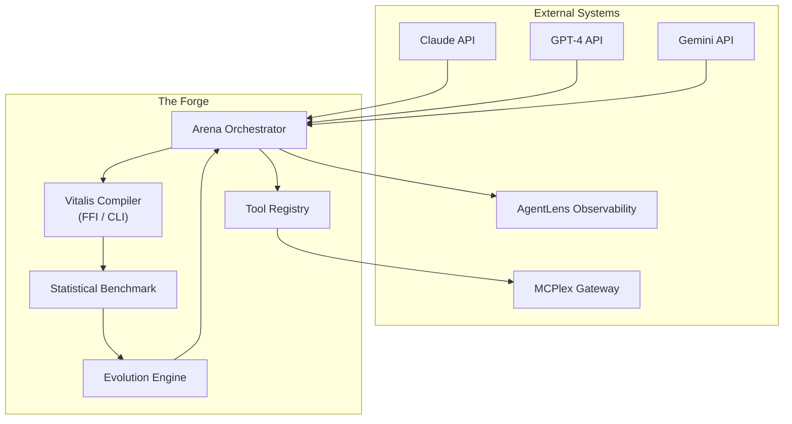
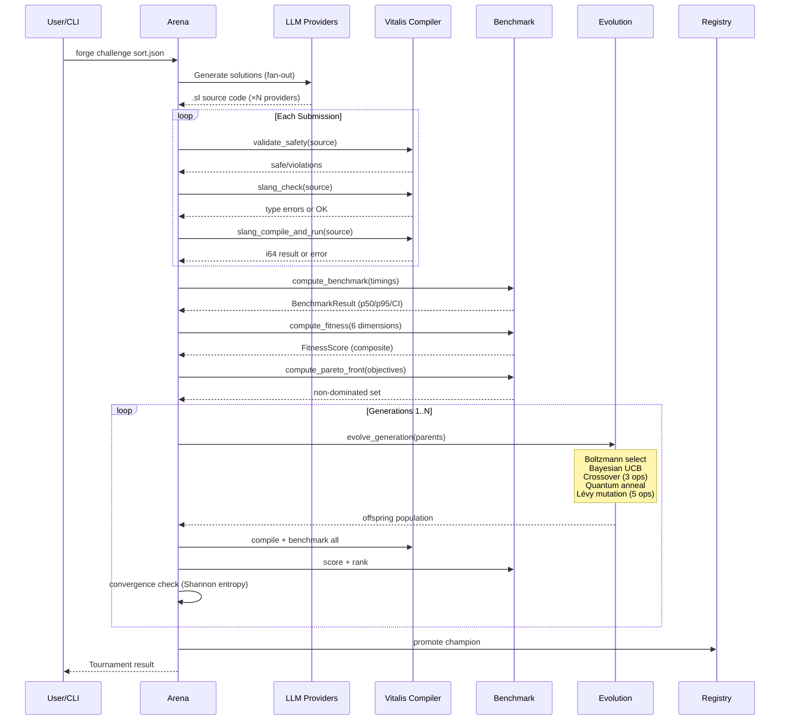

# The Forge — Enterprise Architecture Document

**Version:** 1.0.0  
**Date:** 2026-04-14  
**Classification:** Internal Architecture Reference  
**Author:** Principal AI Systems Architect  

---

## 1. Executive Summary

The Forge is a **compiler-powered agentic evolution platform** that orchestrates multiple Large Language Models (LLMs) in competitive code tournaments. Solutions are compiled through a real JIT compiler (Vitalis), benchmarked with statistical rigor, and evolved through biologically-inspired operators — producing code that exceeds the capability of any individual model.

**Key Differentiator:** The Vitalis JIT compiler serves as an impartial, deterministic arbiter — providing type safety, capability sandboxing, and native-speed execution that no other agent framework offers.

**Core Metrics:**
- Compile + execute latency: **<5ms** (FFI mode) / ~400ms (CLI fallback)
- Statistical benchmark: **Welford online stats** with 95% CI and Welch's t-test
- Selection math: **Native Rust hotpaths** — Boltzmann, Bayesian UCB, quantum annealing
- Evolution: **6 strategies** — 3 crossover, 5 mutation operators, Lévy flight magnitudes
- Multi-objective: **Pareto front** computation across 6 fitness dimensions
- Diversity: **Shannon entropy** monitoring with convergence detection

---

## 2. System Context



---

## 3. Seven-Layer Architecture

### Layer 1: Data Layer — Persistence & Provenance

| Component | Implementation | Purpose |
|-----------|---------------|---------|
| **Tool Registry** | SQLite + filesystem `.sl` files | Stores evolved champion source code and metadata |
| **Evolution Ledger** | Event-sourced append-only log | Immutable record of every generation, mutation, promotion |
| **Benchmark Archive** | Structured JSON/SQLite | Historical performance data with confidence intervals |
| **Fingerprint Index** | SHA-256 dedup set | Prevents evaluating identical submissions twice |
| **Knowledge Graph** | In-memory submission genealogy | Tracks parent → child → champion ancestry chains |

**Data Flow:** Every submission is fingerprinted (SHA-256 of normalized source). Duplicates are detected and eliminated before compilation, saving compute. The evolution ledger is event-sourced — the entire tournament can be replayed from the log.

### Layer 2: Orchestration Layer — Multi-LLM Dispatch

```
┌─────────────────────────────────────────────────────────┐
│                   ARENA ORCHESTRATOR                    │
│                                                         │
│  ┌─────────┐  ┌─────────┐  ┌─────────┐  ┌──────────┐  │
│  │ Claude   │  │  GPT-4  │  │ Gemini  │  │ Local/   │  │
│  │ Adapter  │  │ Adapter │  │ Adapter │  │ Custom   │  │
│  └────┬────┘  └────┬────┘  └────┬────┘  └────┬─────┘  │
│       │             │            │             │        │
│       └─────────────┴────────────┴─────────────┘        │
│                         │                               │
│              Challenge Distribution                     │
│              Response Collection                        │
│              Provider Performance Tracking              │
│              Cost-per-Fitness Optimization               │
└─────────────────────────────────────────────────────────┘
```

**Provider Contract (ProviderFn):**
```python
def provider(description: str, function_signature: str) -> str:
    """
    Input:  Natural language description + .sl function signature
    Output: Complete .sl source code implementing the function
    """
```

Providers are pluggable. The Arena accepts any function matching this signature — real LLM API calls, local models, human submissions, or rule-based generators.

### Layer 3: Compiler Layer — The Impartial Judge

**Component:** Vitalis v1333 JIT Compiler (37MB DLL, 455 modules, 189K LOC)

**Seven Compilation Gates:**

```
┌──────┐    ┌───────┐    ┌────────────┐    ┌──────┐    ┌────────────┐    ┌─────────┐    ┌─────────┐
│ LEX  │ →  │ PARSE │ →  │ TYPE CHECK │ →  │ LINT │ →  │ CAPABILITY │ →  │ COMPILE │ →  │ EXECUTE │
└──┬───┘    └───┬───┘    └─────┬──────┘    └──┬───┘    └─────┬──────┘    └────┬────┘    └────┬────┘
   │            │              │              │              │               │              │
   ▼            ▼              ▼              ▼              ▼               ▼              ▼
 Reject      Reject        Reject          Score         Reject          Reject          Score
 (syntax)    (grammar)     (types)        (quality)     (unsafe ops)    (codegen)       (output)
```

**FFI Integration Architecture:**

```python
# Primary path: ctypes DLL → <5ms
vitalis.dll (37MB) ←── ctypes.CDLL ←── forge/vitalis_ffi.py ←── forge/compiler.py

# Key FFI functions used:
slang_compile_and_run(source)  →  i64 result
slang_check(source)            →  JSON error list
slang_lex(source)              →  JSON token list
slang_parse_ast(source)        →  AST debug string
slang_dump_ir(source)          →  SSA IR dump

# Safety pre-flight:
1. validate_safety() — regex capability gate (no file/network/process ops)
2. slang_check()     — safe type-check only (no codegen, no panic risk)
3. slang_compile_and_run() — full JIT only after pre-flight passes
```

### Layer 4: Benchmark Layer — Statistical Scoring

**All math delegated to Vitalis native Rust hotpaths:**

| Operation | Vitalis Hotpath | Time |
|-----------|----------------|------|
| Mean | `hotpath_mean` | <1µs |
| Standard deviation | `hotpath_stddev` | <1µs |
| Percentiles (p50/p95/p99) | `hotpath_p95`, `hotpath_percentile` | <1µs |
| Median | `hotpath_median` | <1µs |
| Outlier detection | MAD via `hotpath_median` | <2µs |
| Welch's t-test | Python (uses hotpath stddev) | <5µs |
| Pareto front | `hotpath_pareto_front` | <10µs |
| Shannon diversity | `hotpath_shannon_diversity` | <1µs |
| Code quality | `hotpath_code_quality_score` | <1µs |
| Weighted composite | `hotpath_weighted_score` | <1µs |
| Adaptive fitness | `hotpath_adaptive_fitness` | <1µs |

**The Six Fitness Dimensions:**

| Dimension | Weight | Measurement | Vitalis Module |
|-----------|--------|-------------|----------------|
| Correctness | 30% | Test case pass rate | `compile_and_run` |
| Performance | 25% | Relative execution speed (percentile rank) | `hotpath_percentile` |
| Code Quality | 15% | Cyclomatic/cognitive complexity | `hotpath_code_quality_score` |
| Robustness | 15% | Fuzz testing survival rate | `property_testing.rs` |
| Efficiency | 10% | Compile time proxy | `hotpath_mean` |
| Novelty | 5% | Cosine distance from population | `hotpath_cosine_similarity` |

**Adaptive Weight Shifting:** Early generations prioritize correctness (get it working). Late generations prioritize speed and code quality (make it fast and clean). Implemented natively in Rust via `hotpath_adaptive_fitness`.

### Layer 5: Evolution Layer — The Genetic Engine

**Selection Operators (Native Rust):**

| Operator | Vitalis Hotpath | Strategy |
|----------|----------------|----------|
| Boltzmann selection | `hotpath_boltzmann_select` | Temperature-controlled softmax — T→0: greedy, T→∞: uniform |
| Bayesian UCB | `hotpath_bayesian_ucb` | Balance exploitation (high fitness) with exploration (under-tried) |
| Quantum annealing | `hotpath_quantum_anneal_accept` | Accept regressions probabilistically to escape local optima |
| Elite passthrough | Python sort | Top N pass unchanged (elitism) |

**Crossover Operators (3):**

| Operator | Description |
|----------|-------------|
| Uniform | Each line randomly from parent A or B |
| Single-point | Swap tails at a random body line |
| Two-point | Swap a middle segment from B into A |

**Mutation Operators (5):**

| Operator | Description | Magnitude |
|----------|-------------|-----------|
| Swap lines | Swap two adjacent body lines | Fixed |
| Insert guard | Add early-return guard clause | Fixed |
| Change constant | Alter numeric literal | Lévy flight magnitude |
| Add comment | Inject descriptive comment | Fixed |
| Rename variable | Rename let binding | Fixed |

**Lévy Flights:** Mutation amplitude follows a heavy-tailed distribution via `hotpath_levy_step`. Most mutations are small (fine-tuning), but occasionally a large jump occurs (radical restructuring). This balances exploitation with exploration.

**Temperature Scheduling:** The annealing temperature decays exponentially per generation: `T(g) = T₀ × decay^g`. Early generations explore broadly. Late generations exploit the best solutions.

### Layer 6: Observability Layer — AgentLens Integration

**Trace structure per submission:**
```
submission_id: abc12345
├── origin
│   ├── provider: claude
│   ├── generation: 42
│   ├── parent_a: xyz789
│   ├── parent_b: def456
│   └── mutations: [crossover_uniform, const_7->12]
├── compilation
│   ├── gate_reached: execute
│   ├── compile_time_ms: 3.2
│   ├── token_count: 47
│   └── warnings: []
├── fitness
│   ├── correctness: 1.00
│   ├── performance: 0.92
│   ├── code_quality: 0.87
│   ├── novelty: 0.73
│   └── total: 91.7
└── decision: promoted_to_gen_43
```

### Layer 7: Governance Layer — Safety & Control

| Control | Implementation |
|---------|---------------|
| Capability gate | Regex scanner rejects file/network/process/dlopen patterns |
| Type safety | `slang_check()` pre-flight before any JIT execution |
| Execution timeout | Configurable per-submission timeout |
| Memory bound | JIT sandbox allocation limits |
| Regression prevention | Champion must beat current best by >2σ |
| Convergence detection | Shannon diversity + EMA stale counter |
| Kill switch | `tournament.status = "halted"` freezes all evolution |
| Audit trail | Full provenance chain on every submission |

---

## 4. Deployment Architecture

```
┌─────────────────────────────────────────────────────────┐
│                    DEPLOYMENT                           │
│                                                         │
│  ┌─────────────┐  ┌──────────────┐  ┌───────────────┐  │
│  │ Python 3.12 │  │ Rust nightly │  │ vitalis.dll   │  │
│  │ (forge pkg) │  │ (compiler)   │  │ (37MB, FFI)   │  │
│  └──────┬──────┘  └──────┬───────┘  └───────┬───────┘  │
│         │                │                   │          │
│         └────────────────┴───────────────────┘          │
│                          │                              │
│              ┌───────────┴───────────┐                  │
│              │    FORGE CLI / SDK     │                  │
│              └───────────┬───────────┘                  │
│                          │                              │
│           ┌──────────────┼──────────────┐               │
│           ▼              ▼              ▼               │
│     ┌──────────┐  ┌──────────┐  ┌──────────────┐       │
│     │   CLI    │  │ Web Dash │  │  MCP Server  │       │
│     │ (forge)  │  │ (browser)│  │ (agents)     │       │
│     └──────────┘  └──────────┘  └──────────────┘       │
└─────────────────────────────────────────────────────────┘
```

**Prerequisites:** Python 3.12+, Rust nightly, Vitalis built at `C:\Vitalis-V60`

---

## 5. Data Flow — Complete Tournament Lifecycle



---

## 6. Vitalis FFI Surface — Functions Used

### Compiler Pipeline
| Function | Signature | Purpose |
|----------|-----------|---------|
| `slang_compile_and_run` | `(char*) → i64` | Full JIT compile + execute |
| `slang_check` | `(char*) → char*` | Type-check only (safe) |
| `slang_lex` | `(char*) → char*` | Tokenize to JSON |
| `slang_parse_ast` | `(char*) → char*` | Parse to AST debug string |
| `slang_dump_ir` | `(char*) → char*` | Lower to SSA IR dump |
| `slang_version` | `() → char*` | Compiler version string |

### Native Evolution Engine
| Function | Signature | Purpose |
|----------|-----------|---------|
| `slang_evo_register` | `(char*, char*) → void` | Register evolvable function |
| `slang_evo_evolve` | `(char*, char*) → i64` | Submit new variant |
| `slang_evo_set_fitness` | `(char*, f64) → void` | Feed fitness score |
| `slang_evo_get_generation` | `(char*) → u64` | Current generation |
| `slang_evo_rollback` | `(char*, u64) → i64` | Rollback to generation |
| `slang_evo_get_source` | `(char*) → char*` | Get current source |

### Statistical Hotpaths (20+)
| Function | Purpose |
|----------|---------|
| `hotpath_mean` | Numerically stable mean |
| `hotpath_stddev` | Sample standard deviation |
| `hotpath_median` | Median value |
| `hotpath_p95` | 95th percentile |
| `hotpath_percentile` | Arbitrary percentile |
| `hotpath_weighted_score` | Weighted composite, clamped [0,1] |
| `hotpath_code_quality_score` | Multi-factor quality score |
| `hotpath_adaptive_fitness` | Generation-adaptive multi-objective |
| `hotpath_boltzmann_select` | Softmax selection probabilities |
| `hotpath_quantum_anneal_accept` | Metropolis + tunneling acceptance |
| `hotpath_bayesian_ucb` | UCB1 acquisition score |
| `hotpath_levy_step` | Heavy-tailed step magnitude |
| `hotpath_shannon_diversity` | Normalized entropy |
| `hotpath_pareto_front` | Non-dominated solution indices |
| `hotpath_pareto_dominates` | Pairwise dominance check |
| `hotpath_cosine_similarity` | Vector similarity |
| `hotpath_cma_es_mean_update` | CMA-ES weighted mean |
| `hotpath_ema_update` | Exponential moving average |
| `hotpath_softmax` | Numerically stable softmax |
| `hotpath_entropy` | Shannon entropy (bits) |

---

## 7. Security Model

```
THREAT MODEL
═══════════════════════════════════════════════════════════

Threat: LLM generates malicious .sl code
  Mitigation 1: Capability gate (regex scanner) — blocked patterns:
    file_write, file_delete, file_append, http_get, http_post,
    tcp_connect, env_get, process_exec, dlopen
  Mitigation 2: Type-checker pre-flight (no codegen on invalid code)
  Mitigation 3: Execution timeout (configurable, default 10s)
  Mitigation 4: JIT sandbox (Cranelift, no raw system calls)

Threat: Evolution produces unsafe code
  Mitigation: Every evolved submission passes through all 7 gates
  Mitigation: Champion promotion requires statistical significance (>2σ)

Threat: DLL crash from malformed FFI call
  Mitigation: slang_check() pre-flight before slang_compile_and_run()
  Mitigation: Exception handler falls back to CLI subprocess

Threat: Infinite loop in evolved code
  Mitigation: Execution timeout kills after configurable limit
  Mitigation: "while true" without "break" detected by capability gate
```

---

## 8. Performance Characteristics

| Operation | FFI Mode | CLI Mode |
|-----------|----------|----------|
| Compile + run (simple fn) | **3-5ms** | 400-500ms |
| Type-check only | **1-2ms** | 300-400ms |
| Lex only | **<1ms** | 250-350ms |
| Hotpath stat function | **<1µs** | N/A |
| 30-run benchmark | **150ms** | 12,000ms |
| Full tournament (50 pop, 100 gen) | **~30min** | **~8hrs** |

FFI mode provides **80-100× speedup** over CLI mode for the compilation hot-path.

---

*Document prepared for the ModernOps888/Infinity Tech Stack architecture review.*
